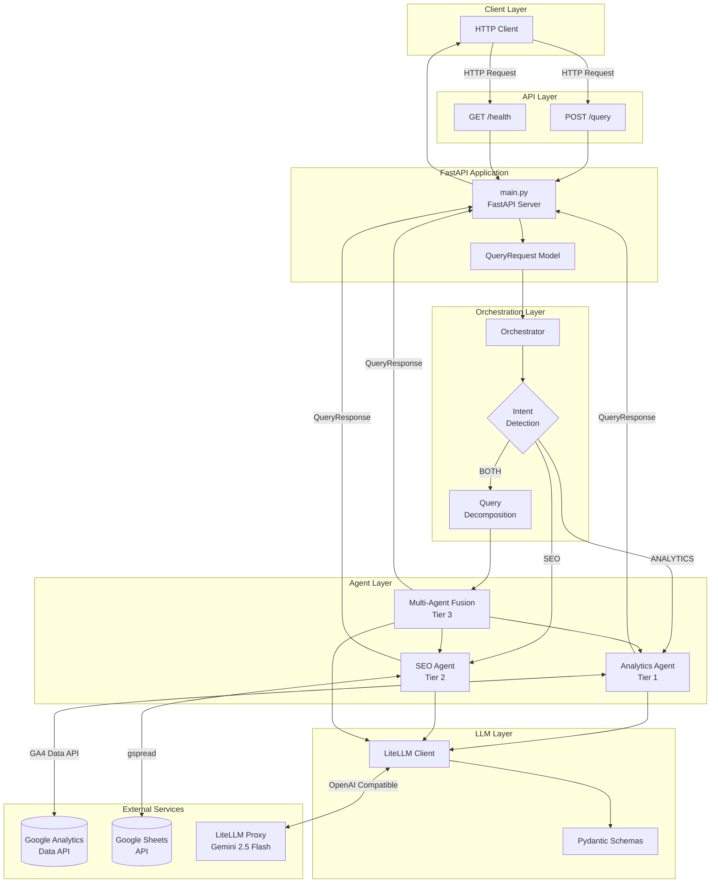
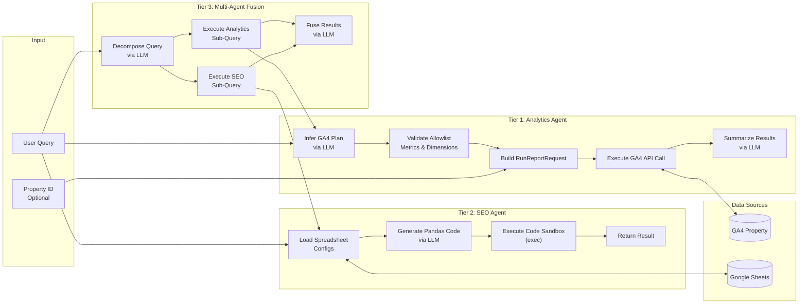
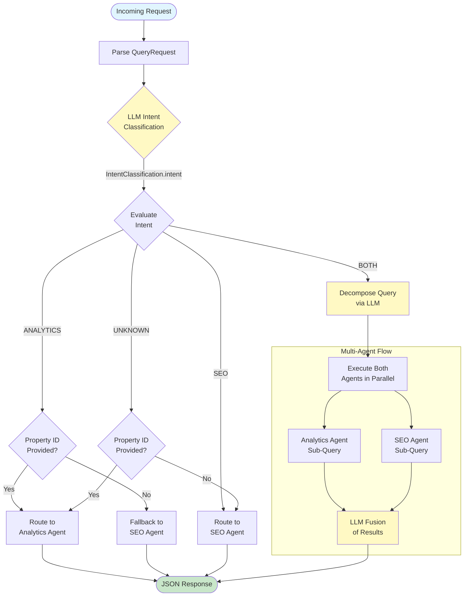
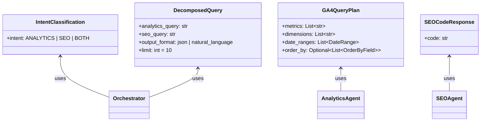
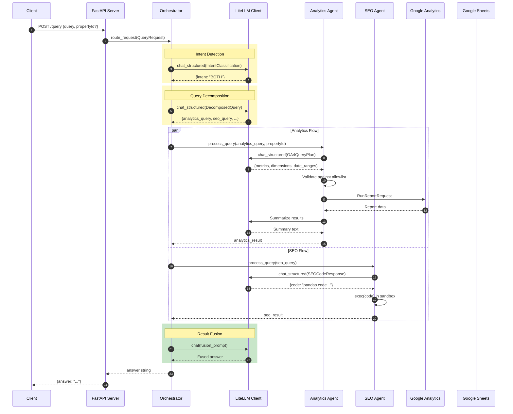

# Spike AI Backend - Architecture Diagrams

## 1. System Flow

This diagram shows the high-level system architecture and how requests flow through the system from API entry to response.

---

## 2. Agent Interactions

This diagram details how the three agent tiers interact with each other and their respective data sources.

### Agent Responsibilities

| Agent | Tier | Data Source | Key Capabilities |
|-------|------|-------------|------------------|
| **Analytics Agent** | 1 | Google Analytics 4 API | - LLM-based query planning - Metric/Dimension allowlist validation - Live GA4 data retrieval - LLM result summarization |
| **SEO Agent** | 2 | Google Sheets (Screaming Frog data) | - Multi-spreadsheet support - LLM-generated Pandas code - Sandboxed code execution - Schema auto-detection |
| **Multi-Agent Fusion** | 3 | Both GA4 + Sheets | - Dynamic query decomposition - URL path normalization - Cross-source data matching - JSON/natural language output |

---

## 3. Orchestrator Routing

This diagram shows the decision-making flow within the orchestrator for routing requests to the appropriate agent(s).

### Routing Decision Matrix

| Detected Intent | Property ID | Action |
|-----------------|-------------|--------|
| `ANALYTICS` | ✅ Provided | Route to Analytics Agent |
| `ANALYTICS` | ❌ Missing | Fallback to SEO Agent |
| `SEO` | Any | Route to SEO Agent |
| `BOTH` | ✅ Provided | Execute both agents + LLM fusion |
| `BOTH` | ❌ Missing | Execute SEO only (Analytics errors gracefully) |
| `UNKNOWN` | ✅ Provided | Fallback to Analytics Agent |
| `UNKNOWN` | ❌ Missing | Fallback to SEO Agent |

### Structured LLM Schemas Used

---

## 4. Complete Request Lifecycle

---

## Key Architecture Highlights

| Component | Technology | Purpose |
|-----------|------------|---------|
| **API Framework** | FastAPI | Async HTTP server with Pydantic validation |
| **LLM Integration** | LiteLLM + OpenAI SDK | Unified interface for Gemini 2.5 Flash |
| **Structured Outputs** | Pydantic + JSON Schema | Type-safe, validated LLM responses |
| **Analytics API** | google-analytics-data | GA4 Data API v1beta client |
| **Sheets API** | gspread + oauth2client | Google Sheets access via service account |
| **Data Processing** | Pandas | DataFrame manipulation for SEO analysis |
